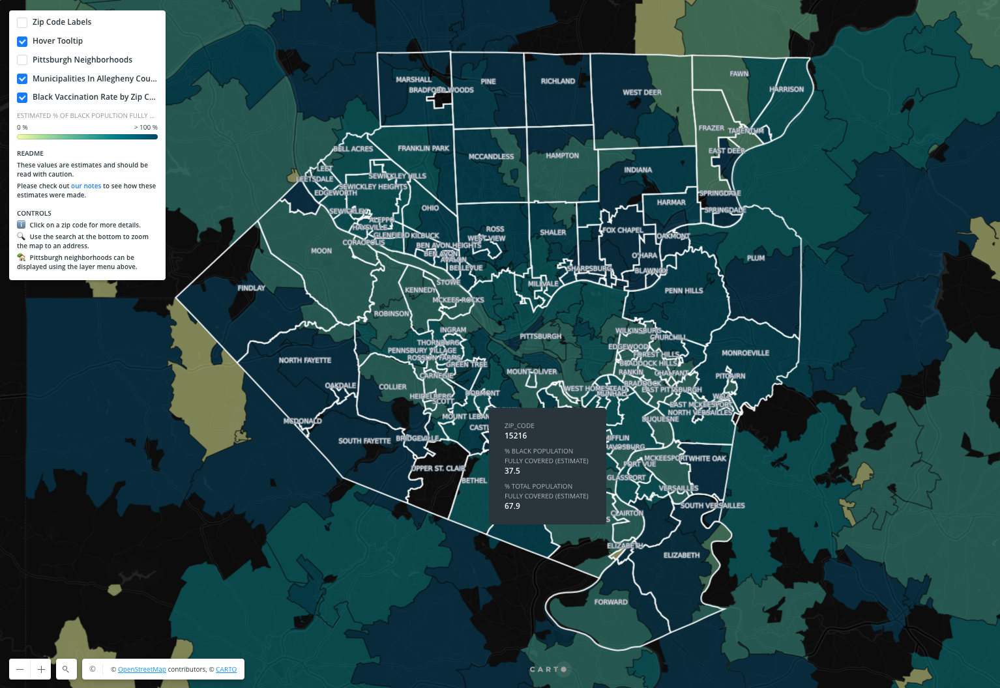

# PA Black Vaccination Rate by Zip Code
Made by the [Black Equity Coalition](https://www.blackequitypgh.org/) and the [Western Pennsylvania Regional Data Center](https://www.wprdc.org).

[](https://wprdc.carto.com/builder/0e278d3c-2c1c-4b0a-91e1-45ef982a0baa/embed#/)
https://wprdc.carto.com/builder/0e278d3c-2c1c-4b0a-91e1-45ef982a0baa/embed#/

This map **estimates** the vaccination rates by dividing the vaccination counts from [PA's vaccination data](https://data.pa.gov/Covid-19/COVID-19-Vaccinations-by-Zip-Code-by-Race-Current-/g743-p9su) by an esitmate of the population eligible for vaccination generated from [American Community Survey](https://www.census.gov/programs-surveys/acs) data.

## ⚠️ Caution
* The ACS population numbers are estimates, and methods may undercount the Black/African American community and other populations. 
* There may be differences between how people report race or ethnicity between the ACS and in the vaccination data. About 9% of the total records in the Allegheny County vaccine data report multiple races, compared to less than 3% of the total population reporting two or more races in the 2019 ACS estimates. 
* About 10% of Allegheny County's vaccination records are reported as race unknown. This missing data may underestimate the % of people vaccinated by racial group.
* Processes linking the vaccination records of people across doses may not correctly match people across doses. The PA Department of Health has developed more-effective matching techniques to connect first and second doses, and released data on 7/9/2021 produced by these improved processes. Data obtained prior to this date do not capture these quality improvements. 
* People that received vaccinations outside of Pennsylvania are unlikely to be captured in this vaccine data. 
* Fully-vaccinated people that received only one dose of a two dose regimen in Pennsylvania may only show up as being partially-vaccinated. 
* Because of data issues like these, and changes to the composition of different communities, some zip codes may show vaccination rates greater than 100%. 
* Zip codes with a low Black population and extemely high vaccination rates (> 200%) have been removed from the map.
* Assumptions have been made in a attempts to esimate population counts. Check-out the [Methods section](#-population-estimation-methods) for details.

## About Vaccine Hesitancy
As efforts to produce a vaccine ramped up, there was much media discussion regarding the presumed vaccine hesitancy of African Americans. Recognizing the harm, trauma, and distrust caused by public health officials and practitioners, medical researchers, pharmaceutical companies, and the federal government in their historic and many contemporary engagements with Black and brown communities, we understand the hesitancy is rooted in distrust, not of the science of vaccinations, but of the institutions and scientists. Members of the BEC are actively engaged in activities to work with these institutions on practices to increase their trustworthiness.

Add text on barriers to access here. Talk about digital access for appointment scheduling, pharmacy/health care deserts.

## 💾 Download
Data stored in the [/data](/data) folder may be stale and not match the current set of data in the map.  Please check the modification dates in github.  An archive of the commonwealth's data updates can be found [on the WPRDC](https://data.wprdc.org/dataset/weekly-pennsylvania-covid-19-vaccinations-stats-archive).

* [csv](https://github.com/WPRDC/bec-vaccination-map/raw/main/data/Black_Vaccination_Rate_by_Zip_Code.csv)  
* [geojson](https://github.com/WPRDC/bec-vaccination-map/raw/main/data/Black_Vaccination_Rate_by_Zip_Code.geojson)  
* [shapefile](https://github.com/WPRDC/bec-vaccination-map/raw/main/data/Black_Vaccination_Rate_by_Zip_Code.zip)  

## 📣 Share
* This page: https://github.dev/WPRDC/bec-vaccination-map
* The map: https://wprdc.carto.com/builder/0e278d3c-2c1c-4b0a-91e1-45ef982a0baa/embed#/
* Embded code: `<iframe width="100%" height="520" frameborder="0" src="https://wprdc-maps.carto.com/u/wprdc/builder/0e278d3c-2c1c-4b0a-91e1-45ef982a0baa/embed" allowfullscreen webkitallowfullscreen mozallowfullscreen oallowfullscreen msallowfullscreen></iframe>
`

## 📆 Update Frequency
The data for this map updates as frequently as the PA Department of Health updates their release on the PA Open Data portal.  Population numbers are esimates from 2019; once 2020 census data is available at the zip code level, population numbers may be updated.

## 🗄️ Data Sources
### Pennsylvania's COVID-19 vaccination data
Provides vaccination numbers by race per zip code.  
https://data.pa.gov/Covid-19/COVID-19-Vaccinations-by-Zip-Code-by-Race-Current-/g743-p9su

### American Community Survey (ACS): 
Yearly population estimates are generated by the US Census Bureau by surveying a sample of the population.  
https://www.census.gov/programs-surveys/acs

#### ACS tables used
table | description
----------|------------
| B01001_001 	|	total pop |
| B01001_003 	|	boys < 5 |
| B01001_004 	|	boys 5 - 9 |
| B01001_027 	|	girls < 5 |
| B01001_028 	|	girls 5 - 9 |
| B01001B_001 	|	black total pop |
| B01001B_003 	|	black boys < 5 |
| B01001B_004 	|	black boys 5 - 9 |
| B01001B_018 	|	black girls < 5 |
| B01001B_019 	|	black girls 5 - 9 |

## 🧮 Population Estimation Methods
To estimate the number of people elgible for vaccinations in a zip code, we attempt to estimate the number of people 12 or older.  
1. Get total population and population under 10y/o counts (`kid_pop` below) from ACS for everyone and just the Black population.
```python
# demonstration of how ACS tables relate to our data
total_pop = B01001_001
total_kid_pop = B01001_003 + B01001_004 + B01001_027 + B01001_028
black_pop = B01001B_001
black_kid_pop = B01001B_003 + B01001B_004 + B01001B_018 + B01001B_019
```
2. Assuming an even distribution across the years (:rotating_light: probably a big assumption), we can turn our "< 10-years-old" estimates into "< 12-years-old" ones by multiplying that value by 1.2.
```python
total_ineligible = total_kid_pop * 1.2
total_black_ineligible = black_kid_pop * 1.2
```
3. Subtract that from the total popuation to get an esimate of the eligible populations per zip code.
```python
total_eligible = total_pop - total_ineligible
total_black_eligible = total_black_pop - total_black_ineligible

```

## Extras
* [Code snippets](notes.md)
* [Popultion data by Zip code](zip_code_pop_2019.csv)

